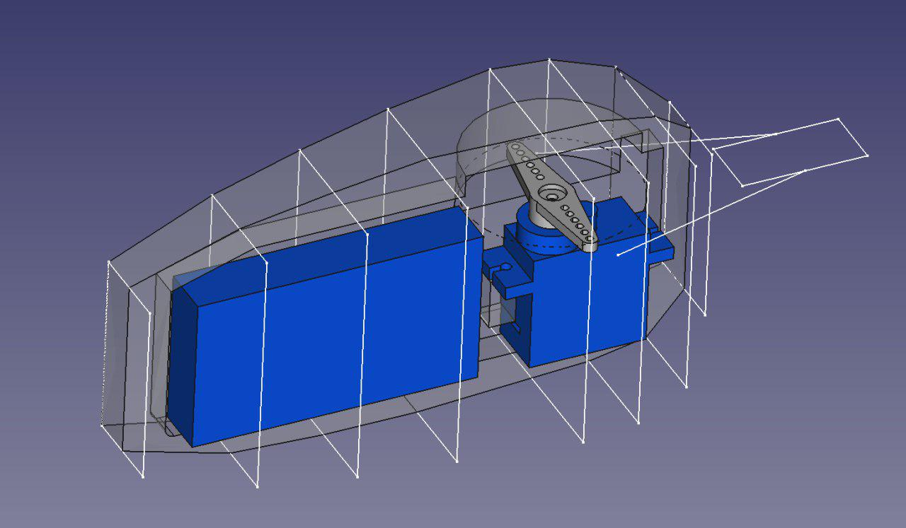
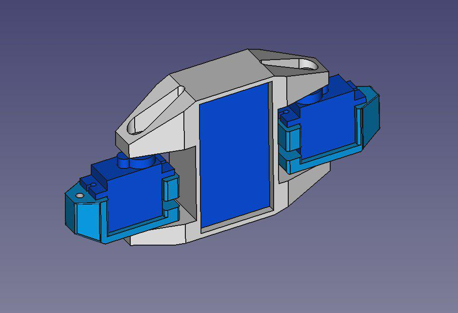
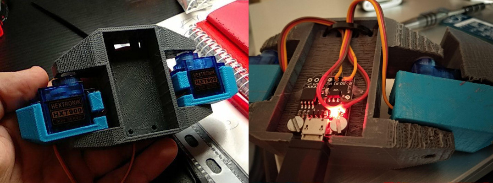
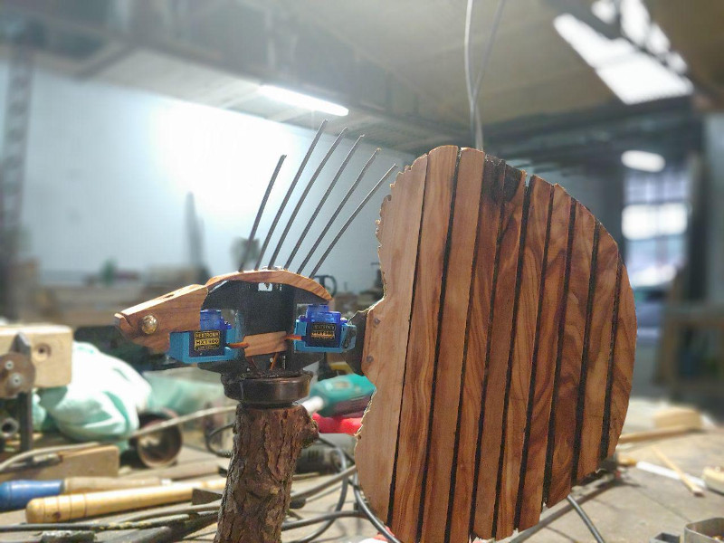

# Fish && Chips

An Open Source Fish Robot

**Note:** This is a Work in Progress

#### Authors
* [Cristina De Propios](https://twitter.com/de_propios) - [Website](http://www.depropios.com/)
* [David Estévez Fernández](https://twitter.com/DEFrobotics) - [Website](https://destevez.me)

## The Project

For this collaboration, we wanted a project that would allow us to design something functional and aesthetically pleasing. We also wanted the project to be a challenge. Due to our backgrounds it was more or less clear from the beginning that it had to be a robot but... what kind of robot?

We considered different animals as inspiration for our robot, but something about fish draw our attention. Their hypnotic movement, and the fact that they exist in a great variety of shapes and sizes, offered us a wide range of possibilities for our design. In addition, the natural medium for fish is water, which does not get along pretty well with electronics, making fish robots a rare morphology compared with other kind of robots such as hexapods, quadrupeds or humanoids, and creating the challenge we were looking for. 

A key idea while developing the project was that it should foster creativity, allowing people to create their own versions of the fish, even by traditional means, without requiring digital fabrication machines. For this purpose, our fish robot is composed of two main components. The first one is a standard core, that serves as a base for the fish, and offers an already tested solution for its movement and control, removing the need for advanced electronics or programming knowledge. The second one is a skin that surrounds the fish core and provides fins and a tail to propel the fish in water, as well as its external appearance. 

Being divided in two components makes is a perfect educational platform as it is possible to work on different aspects of the robot at different levels: from simply designing new skins to surround a standard core to a deeper understanding of the programming, electronics and mechanics of the robot by modifying the core.

This project is still a work in progress, but we deeply believe in the Open Source philosophy, so we are releasing our development files as we are developing and improving them. The prototype, along with other tests and experiments, will be displayed at the [Open Source Hardware Demonstration (OSHWDem) 2019](https://oshwdem.org/).

## Betta Fish: The Peleator

For the first robotic fish of this project, the *Peleator*, we chose as inspiration a species widely used as a pet: the Betta Fish. The Betta Fish (*Betta splendens*) is also known as the Siamese Fighting Fish, hence the name Peleator¹. One characteristic trait of this species is their aggresivity towards other fish, including members of its own species.

We like this species because of three things: it's a though fighter, it's beautiful, and it's easy to maintain, requiring little more than food. Just like us.

¹ For all non-spanish speakers out there, Peleator is a made-up-latin name derived from *pelear*, which means *to fight* in spanish. It also sounds like a name one would use for a large translatlantic boat, which (for us) makes it even funnier.

## Evolution

Technology, as life, does not suddenly appear fully developed. Instead, it is perfected through evolution, iterating over different versions and correcting errors.  Or, as the fish saying goes: "one has to learn to move its fins before it can swim".

This section will show the evolution of the different prototypes for the *Peleator*. The aim of the first version is not to be submergible, but to grasp a good notion of the robot needs, both in terms of technical components and aesthetics. Swimming is a larger challenge that will come later on.

### Early prototypes
The idea behind the early prototypes was to put everything that could not be in contact with water (e.g. LiPo battery, electronics) in the body of the fish, sealing it so that it was watertight. We built some versions of this prototype, but the main challenge was to keep the body watertight while transmitting the motor movement outside the body. This version was discarded, and we moved on to the next one.

### Working core
For the next iteration, we decided to make a core to support all the electronics, motors and batteries, similar to a "skeleton" for the fish. This would no longer need to be watertight, as later a skin would cover the fish, isolating the internal components.

### Tail and Skin
To gain some knowledge about the fish movement that could be later used in a watertight version, a tail and outer skin were developed in wood as a proof of concept. The focus of this iteration, as mentioned before, was to develop some movement patters that would resemble the fluid movement of a Betta Fish.

### Future iterations
Once we have gained enough insight of the fish movement, the next step will be to develop a submergible version, that will need to deal with issues as flotability, remote control underwater / autonomy and, of course, keeping the electronics and batteries dry.

## Building a Peleator

**NOTE**: THIS IS A WORK IN PROGRESS. IT PROBABLY WON'T WORK RIGHT AWAY, SO PLEASE KEEP THIS IN MIND BEFORE BUILDING ONE. WE ARE CURRENTLY FOCUSED ON DEVELOPMENT, SO NO FURTHER SUPPORT WILL BE PROVIDED FOR BUILDING AN EARLY PROTOTYPE. YOU ARE ON YOUR OWN (GOOD LUCK!)

### Mechanics
The fish core is composed of several 3D printed parts, that can be found in the FreeCAD file in this repo.

The fish skin is currently made of wood parts made by hand, so unfortunately there is no way to obtain them (unless you make them yourself).

### Circuits

For the electronics and actuators, an Arduino Uno board and two 9G hobby servos are required. Future versions will probably include smaller boards (e.g. Digispark, Serpente, etc). 

### Programming
This repository contains a test code that can be used for some of the fish movements, altough it is still work in progress.
